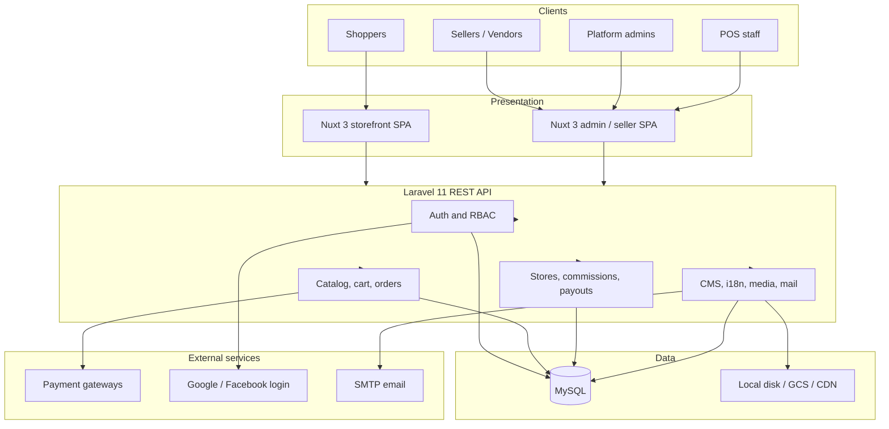
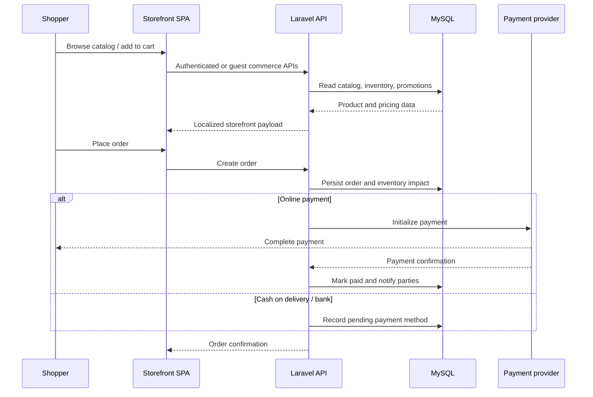

# System architecture

High-level architecture of the Markettoo multi-vendor marketplace.

## Component flow

## Request path (simplified)

Infrastructure hostnames, credentials, and environment-specific deployment details are intentionally omitted.
